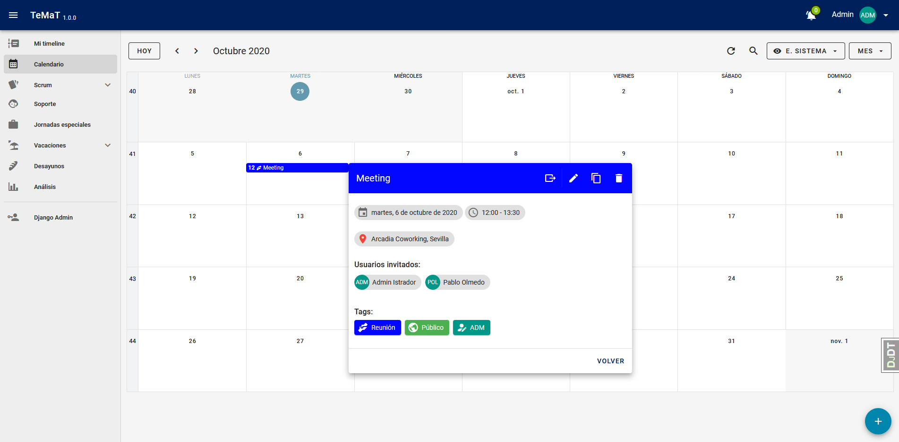

# TeMaT - TEam MAnagement Tool


## Overview

In order to embrace a **paperless** team management, I decided to develop a simple but useful SPA that allowed our team to get rid of those **annoying excel files**.

The app consists of 6 main modules:

- A **calendar** where see all team-related events.
- A **Scrum-based** work manager.
- **Holidays** management.
- "**Support**" management (each day a team member is responsible for the support inbox).
- **Special working days** management (mainly public holidays).
- An "**analytical**" module with multiple charts related to the other 5 modules.

One extra module was added due to popular acclaim: **Breakfasts management**.



Table of Contents:

- [TeMaT - TEam MAnagement Tool](#temat---team-management-tool)
  - [Overview](#overview)
  - [Used frameworks & libraries](#used-frameworks--libraries)
    - [Backend](#backend)
    - [Frontend](#frontend)
  - [Prerequisites](#prerequisites)
  - [Installation](#installation)
    - [Development](#development)
    - [Production](#production)
  - [Quickstart](#quickstart)
    - [First run](#first-run)
      - [1. Configuring the app](#1-configuring-the-app)
      - [2. Running migrations](#2-running-migrations)
      - [3. Creating an admin user](#3-creating-an-admin-user)
      - [4. Populating the db](#4-populating-the-db)
    - [Serving the app](#serving-the-app)
      - [Development mode](#development-mode)
        - [Shell 1](#shell-1)
        - [Shell 2](#shell-2)
      - [Production mode](#production-mode)
        - [Build & serve](#build--serve)
        - [Serve only (if you have built the project before)](#serve-only-if-you-have-built-the-project-before)
  - [Disclaimer](#disclaimer)
  - [Changelog](#changelog)
  - [License](#license)

## Used frameworks & libraries

### Backend

- [Django](https://www.djangoproject.com/)
- [Django Rest Framework](https://www.django-rest-framework.org/)

### Frontend

- [Vue.js](https://vuejs.org/)
- [Vuetify](https://vuetifyjs.com/en/)
- [Highcharts](https://www.highcharts.com/)

## Prerequisites

- [Python 3.7](https://www.python.org/downloads/)
  - [Pipenv](https://pipenv.readthedocs.io/en/latest/)
- (Optional) [Node.js](https://nodejs.org/en/download/)

## Installation

### Development

```bash
cd frontend
npm ci
cd ../backend
pipenv sync --dev
```

### Production

```bash
cd backend
pipenv sync
```

## Quickstart

### First run

#### 1. Configuring the app

The app needs a ```.env``` file placed in ```backend/temat``` to run. You can see the example file: [.env.example](backend/temat/.env.example)

If you omit the ```DATABASE_URL``` parameter, a **SQLite** database will be created in ```backend``` folder.

#### 2. Running migrations

```bash
cd backend
pipenv run python manage.py migrate
```

#### 3. Creating an admin user

```bash
cd backend
pipenv run python manage.py createsuperuser
```

#### 4. Populating the db

It's mandatory to populate some database tables before using the app the first time. It can be done by using the ```django admin```, available at [http://localhost:8000/admin](http://localhost:8000/admin) (after serving the app).

You'll probably want to add event and user story types, as they're required fields. I decided not to create default records so everyone could customize them.

### Serving the app

#### Development mode

##### Shell 1

```bash
cd backend
pipenv run runserver
```

##### Shell 2

```bash
cd frontend
npm run serve
```

#### Production mode

##### Build & serve

```bash
cd frontend
npm run build
cd ../backend
pipenv run python manage.py collectstatic --no-input
pipenv run serve
```

##### Serve only (if you have built the project before)

```bash
cd backend
pipenv run python manage.py collectstatic --no-input
pipenv run serve
```

In both cases, the app will be available at [http://localhost:8000/](http://localhost:8000/)

## Disclaimer

- This application has been developed **with barely Vue.js knowledge**. Learning Vue.js was, in fact, the motivation to start developing it. I tried to do my best, but I'm sure there is a bunch of things to improve. I'd like to update the repo with the new good practices I learn. If you want to collaborate, **feel free to send a pull request**.
- The scope of the application was defined according to **my own team's needs**. Again, **feel free to fork the project and change it if it don't fit your team's needs**.
- The application doesn't scale well (as it loads the entire user list in the vuex store) neither allow you to manage more than one team. In case you were planning to use it with a big team (>50 people?), I'd change the behaviour of the users dropdown.
- Although the source code is written in english, the app texts are in spanish. I had no time for translate the entire app.

## Changelog

See [Changelog](CHANGELOG.md).

## License

See [License](LICENSE).
